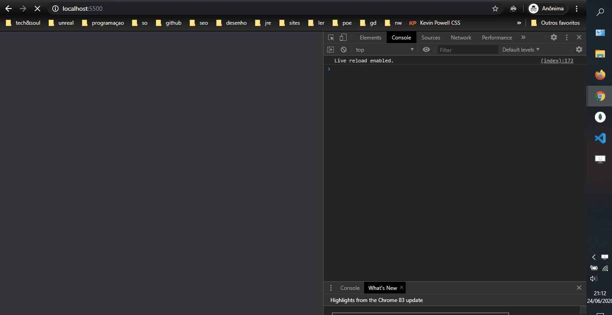

# Skeleton of a NodeJS application with Passport, JWT, Facebook-Authentication with Typescript

Hi there, this repository implements a server based API to authenticate users with passport, jwt, passport-facebook, typescript, typegoose, https and babel (and many other packages). I hope it can be useful for your endeavors in web developing and wish you health :)

Bellow you can see the application running.



## Index

- [Sources](#Sources)
- [How does it work?](#How-does-it-work?)
- [Registration and login](#Registration-and-login)
- [Strategy 1: authentication-needed](#authentication-needed)
- [Strategy 2: facebook-auth](#facebook-auth)
- [Strategy 3: facebook-authentication-needed](#facebook-authentication-needed)
- [How to use?](#How-to-use?)
- [Final Thoughts](#Final-Thoughts)

## Sources

In order to setup the typescript environment, I followed [this video](https://www.youtube.com/watch?v=rCeGfFk-uCk) by Rocketseat (Brazilian masters) that explains in great detail how to use Typescript in NodeJS. In this video, Diego Fernandes shares his working Typescript environment, a great watch.  The dependency packages uses yarn, but can easily be accustomed to npm

In order to setup the passport and jwt environment, I followed [this amazing and in-depth article](https://zachgoll.github.io/blog/2019/choosing-authentication-strategy/) by Zach Gollwitzer. It goes in great detail about what Passport and JWT are, why to use them, and even some other techniques like session authentication, that I didn't thought was necessary for this application (it is a very long article, but is the best source of documentation I have seen about Passport and JWT, recommended).

## How does it work?

On a broader view, **passport and jwt are used as a checker**, to understand if you are who you say you are. So, if you want to protect a route of your app with a middleware (a checker), this setup gives you that possibility. 

**The passport middleware uses strategies** for different verifications. They are called once you define your route, and you can put as many middleware (checkers) as you desire, just need to be careful and always use a done(). In the app, I used three strategies: 
- [authentication-needed](#authentication-needed)
- [facebook-auth](#facebook-auth)
- [facebook-authentication-needed](#facebook-authentication-needed)

The passport strategies are in /src/config/passport.ts.

## Registration and login

Before talking about the strategies used, it is important to note that **some routes do not require a JWT token**, specifically, the login and register routes. This is because in order to access these endpoints, the **user does not need to go thru a checker**, it can just freely access this routes.

When the user uses the **registration** endpoint, the server accesses a function in the userController. This function **generates a hash and a salt** in order to **preserve the passwords safety** by not inserting it in the database.

On **login**, the function **takes the hash + the salt**, and **compares it to the given password** by the user. If **successfully** compared, it **generates a JWT token**, using jsonwebtoken.sign (in utils, line 59) which the user will use from now to access the routes protected by the authentication-needed middleware.

Note: the sign function uses a private key, because the algorithm used is RSA, for more detail about asymmetric key and how the program does this, I highly recommend seeing [Mr. Gollwitzer article](https://zachgoll.github.io/blog/2019/choosing-authentication-strategy/).

Note 2: in this case I used username and password, in hindsight, an email instead of username would probably be better (regarding uniqueness and information)

## authentication-needed

This strategy uses the Passport + JWT approach, where you use some credentials to verify if the user exists, by deconstructing the payload (the content of the sent JWT). After that, if the JWT is valid (not tampered or expired), the middleware passes (using done) and the user can do his thing.

## facebook-auth

In order to go thru Facebook Oauth's authentication, I used passport-facebook. Passport has, as of now [502 different strategies](http://www.passportjs.org/docs/) that you can use for just about everything, and Facebook is one of them. So what is Facebook's authentication work? 

```
------------------------------------------------------------------------------------------------------
|  User (web-client)                          Our Server                         Facebook Server     |
------------------------------------------------------------------------------------------------------
|                                                                                                    |
|  Client requests facebook auth                                                                     |
|                                                                                                    |
|                                         Receives request                                           |
|                                                                                                    |
|                       Passes request to facebook server with options regarding the                 |
|                         fields we want to get from the client (email, name, etc.)                  |
|                                                                                                    |
|                                                                                                    |
|                                                            Facebook asks client if he agrees with  |
|                                                                 our request for his information    |
|                                                                                                    |
|  Client agrees or disagrees                                                                        |
|                                                                                                    |
|                                                                  If Agree, Facebook sends us       |
|                                                                        the client info to our      |
|                                                                  /auth/facebook/callback route     |
|                                                                                                    |
|                                                                                                    |
|                          With the user info, we can check if he already                            |
|                         already exists in db, if not, we create a new doc                          |
|                                       with facebook info                                           |
|                                                                                                    |
|                       We also generate a JWT, so the user is logged right after                    |
|                               accepting our request for information                                |
|                                                                                                    |
|                                                                                                    |
|  Every request after, the client                                                                   |
|       uses the given JWT                                                                           |
|                                                                                                    |
------------------------------------------------------------------------------------------------------
```

The tricky part in the diagram is the callback part. In order for Facebook to know what our callback is, we have to write it in our Facebook app in a field called **Valid OAuth Redirect URIs**. 

And that's about it, I believe. 

Note: if the client disagrees, in our callback route, we must pass a failureRedirect, so Facebook knows where to send the information.

## facebook-authentication-needed

Has you can see by the previous diagram, this strategy uses a JWT in the request to access the protected routes by this middleware. For every request of this routes, the server compares the given token and decides to let the client pass or deny.

## How to use?

So, if you cloned the repo and run yarn and run the server, you might have noticed that there are a bunch of errors regarding the private keys, the public key and a certificate(hopefully the only errors)

In order to use HTTPS, you need to have a valid certificate (HTTPS is required by Facebook) and the correspondent private key. To use the crypto functions in /lib/utils, you need a public and private key for asymmetric encryption. 

To generate them, I used Window's OpenSSL, you can find references to how to make these files in the following links. [generate-certificate](https://tinyurl.com/y9bbsvdp), [generate-rsa-keys](https://tinyurl.com/ycxdae4b)

Note: I just saw [this article](https://tinyurl.com/yclv3yyr) about creating a self-sign certificate in Powershell, might be a different option besides OpenSSL.

## Final Thoughts

I hope this repository was useful to you. 

By doing this skeleton I learned a lot about authentication, but most important, this is my way to cherish the contributions made by Rocketseat and Zack Gollwitzer. Thank you very much for your work.

I will be using this skeleton to make a NodeJS / ReactJS typescript environment E-Commerce project. Hopefully I can make it work.

Thank you for reading, be safe and wish you kind regards :)